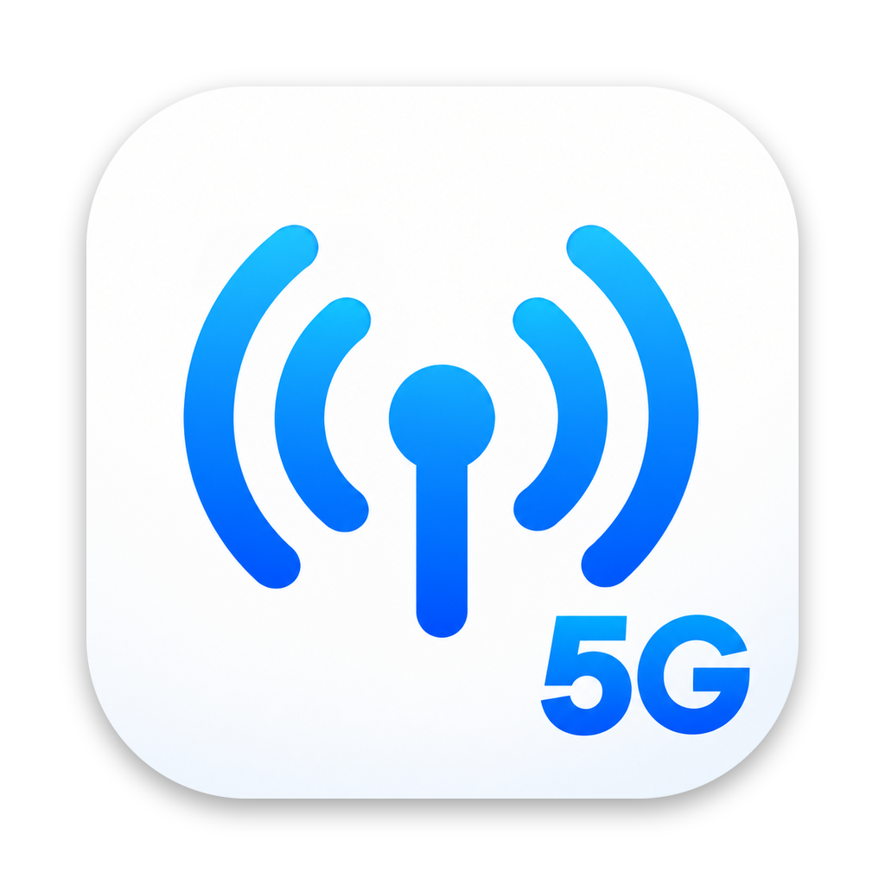

<h1 align="center">iOS Carrier Switch</h1>

Приложение для macOS и Windows, которое помогает выбрать системный операторский профиль отдельно для каждой SIM или eSIM iPhone. Python и необходимые зависимости включены в сборки.

## Скачать

| Платформа | Архив |
| --- | --- |
| Mac Apple Silicon, macOS 14+ | [Carrier_1.0.3.zip](https://github.com/dorian6996/iOS-Carrier-Switch/releases/download/v1.0.3/Carrier_1.0.3.zip) |
| Mac Intel, macOS 13+ | [Carrier-Intel_1.0.3.zip](https://github.com/dorian6996/iOS-Carrier-Switch/releases/download/v1.0.3/Carrier-Intel_1.0.3.zip) |
| Windows 10/11 x64 | [Carrier-Windows_1.0.3.zip](https://github.com/dorian6996/iOS-Carrier-Switch/releases/download/v1.0.3/Carrier-Windows_1.0.3.zip) |

## Установка и запуск

Распакуйте архив и откройте `Carrier.app` на Mac (`Carrier-Intel.app` на Intel) или `Carrier.exe` в Windows. На Windows требуется iTunes, установленный с сайта Apple. Подключите iPhone по USB, разблокируйте его и подтвердите доверие к компьютеру. В разделе «Профили» выберите профиль для нужной SIM и нажмите «Применить профили…». Не отключайте телефон до завершения операции.

Для МТС приложение предлагает Vodafone Turkey, для МегаФона — Vodafone Ukraine, для Билайна — Vodafone Hungary. Это кандидаты по отзывам пользователей; работу связи после применения нужно проверить вручную. Сама SIM, её IMSI и тариф не меняются.

## Копии и восстановление

Перед изменением приложение сохраняет доступные файлы Books и настройки на компьютере. Копии и журнал операций находятся здесь:

- **macOS:** `~/Library/Application Support/Carrier/runs`
- **Windows:** `%LOCALAPPDATA%\Carrier\runs`

Если операция прервалась, откройте раздел «Восстановление» и выберите «Восстановить незавершённую операцию». Не удаляйте копии до завершения проверки. Прогресс чтения, закладки и заметки Books могут потеряться; не открывайте Books и не запускайте другую синхронизацию во время операции.

«Вернуть штатные профили» удаляет все корневые 15-значные IMSI-ссылки, включая созданные другими инструментами.

## Проверка результата

После применения отдельно проверьте мобильный интернет, звонки, SMS, VoLTE, вызовы по Wi-Fi, MMS и режим модема для каждой изменённой SIM. Успешная запись профиля не подтверждает работу 5G, диапазонов n78/n79 или кодека EVS. После перезагрузки iPhone или обновления iOS профиль может потребоваться применить снова.

Основано на исходном скрипте CarrierSIM (vl_w). Используются AirLift (0xjohnnydev), pymobiledevice3 (Doron Ofek и сообщество), Python и PyInstaller.
